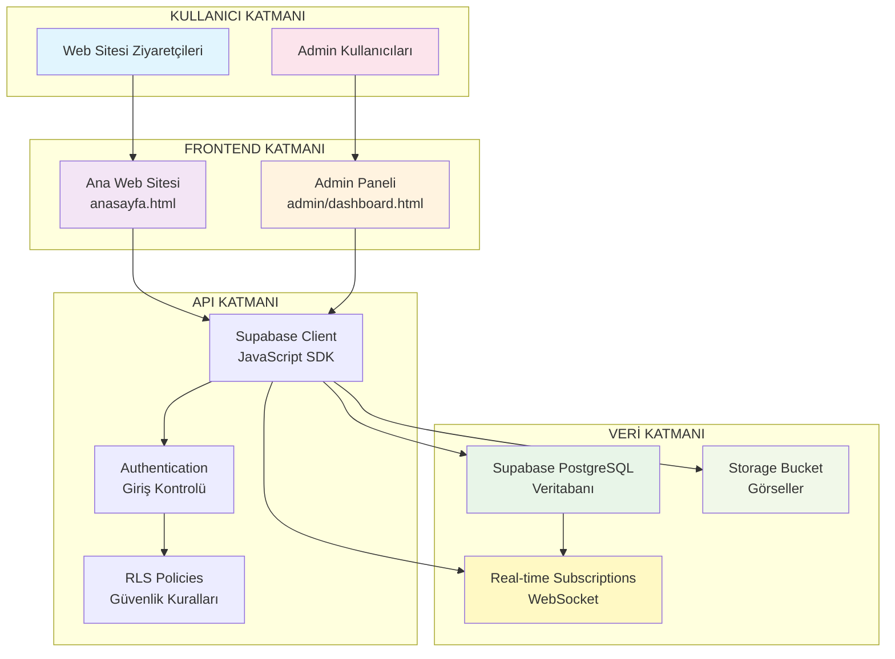

# 🔄 SYNC CONFIG - SENKRONİZASYON YAPILANDIRMA DOSYASI

## 🌐 SİSTEM BAĞLANTI DİYAGRAMI



## 🔧 REAL-TIME SENKRONİZASYON KONFİGÜRASYONU

### Frontend - Admin Panel Senkronizasyonu

```javascript
// js/sync-manager.js
class SyncManager {
  constructor() {
    this.subscriptions = new Map();
    this.eventBus = new EventTarget();
    this.isAdmin = window.location.pathname.includes('/admin/');
    this.initializeSync();
  }

  initializeSync() {
    // Ana veri tablolarını dinle
    this.subscribeToTable('books', this.handleBookChange.bind(this));
    this.subscribeToTable('authors', this.handleAuthorChange.bind(this));
    this.subscribeToTable('banners', this.handleBannerChange.bind(this));
    
    console.log('🔄 Sync Manager başlatıldı:', this.isAdmin ? 'Admin Panel' : 'Web Sitesi');
  }

  subscribeToTable(tableName, callback) {
    const subscription = supabase
      .channel(`${tableName}_sync`)
      .on('postgres_changes', {
        event: '*',
        schema: 'public',
        table: tableName
      }, callback)
      .subscribe();

    this.subscriptions.set(tableName, subscription);
    console.log(`📡 ${tableName} tablosu dinleniyor`);
  }

  // Kitap değişikliklerini işle
  handleBookChange(payload) {
    console.log('📚 Kitap değişikliği:', payload);
    
    const { eventType, new: newRecord, old: oldRecord } = payload;
    
    // Custom event yayınla
    this.eventBus.dispatchEvent(new CustomEvent('bookChange', {
      detail: { eventType, newRecord, oldRecord }
    }));

    // UI'yi güncelle
    switch(eventType) {
      case 'INSERT':
        this.handleBookInsert(newRecord);
        break;
      case 'UPDATE':
        this.handleBookUpdate(newRecord);
        break;
      case 'DELETE':
        this.handleBookDelete(oldRecord);
        break;
    }
  }

  // Yazar değişikliklerini işle
  handleAuthorChange(payload) {
    console.log('👤 Yazar değişikliği:', payload);
    
    const { eventType, new: newRecord, old: oldRecord } = payload;
    
    this.eventBus.dispatchEvent(new CustomEvent('authorChange', {
      detail: { eventType, newRecord, oldRecord }
    }));

    switch(eventType) {
      case 'INSERT':
        this.handleAuthorInsert(newRecord);
        break;
      case 'UPDATE':
        this.handleAuthorUpdate(newRecord);
        break;
      case 'DELETE':
        this.handleAuthorDelete(oldRecord);
        break;
    }
  }

  // Banner değişikliklerini işle
  handleBannerChange(payload) {
    console.log('🖼️ Banner değişikliği:', payload);
    
    const { eventType, new: newRecord, old: oldRecord } = payload;
    
    this.eventBus.dispatchEvent(new CustomEvent('bannerChange', {
      detail: { eventType, newRecord, oldRecord }
    }));

    if (eventType === 'UPDATE' || eventType === 'INSERT') {
      this.refreshBanners();
    }
  }

  // Kitap ekleme UI güncellemesi
  handleBookInsert(book) {
    if (this.isAdmin) {
      // Admin panelinde kitap listesini güncelle
      this.addBookToAdminList(book);
      this.showNotification('Yeni kitap eklendi: ' + book.title, 'success');
    } else {
      // Ana sitede kitap kartlarını güncelle
      this.addBookToGrid(book);
      this.updateBookCounters();
    }
  }

  // Kitap güncelleme UI güncellemesi
  handleBookUpdate(book) {
    const bookElement = document.querySelector(`[data-book-id="${book.id}"]`);
    if (bookElement) {
      this.updateBookElement(bookElement, book);
    }
    
    if (this.isAdmin) {
      this.showNotification('Kitap güncellendi: ' + book.title, 'info');
    }
  }

  // Kitap silme UI güncellemesi
  handleBookDelete(book) {
    const bookElement = document.querySelector(`[data-book-id="${book.id}"]`);
    if (bookElement) {
      bookElement.remove();
    }
    
    if (this.isAdmin) {
      this.showNotification('Kitap silindi: ' + book.title, 'warning');
    }
    
    this.updateBookCounters();
  }

  // UI yardımcı fonksiyonları
  addBookToGrid(book) {
    const bookGrid = document.querySelector('.book-grid, .books-container');
    if (bookGrid) {
      const bookCard = this.createBookCard(book);
      bookGrid.insertAdjacentHTML('afterbegin', bookCard);
    }
  }

  addBookToAdminList(book) {
    const adminTable = document.querySelector('#booksTable tbody');
    if (adminTable) {
      const row = this.createBookRow(book);
      adminTable.insertAdjacentHTML('afterbegin', row);
    }
  }

  createBookCard(book) {
    return `
      <div class="book-card relative group" data-book-id="${book.id}">
        <div class="relative overflow-hidden rounded-lg">
          
          ${book.is_new ? '<span class="absolute top-2 left-2 bg-green-500 text-white px-2 py-1 text-xs rounded">YENİ</span>' : ''}
          ${book.is_bestseller ? '<span class="absolute top-2 right-2 bg-red-500 text-white px-2 py-1 text-xs rounded">ÇOK SATAN</span>' : ''}
        </div>
        <div class="p-4">
          <h3 class="font-semibold text-lg mb-2">${book.title}</h3>
          <p class="text-gray-600 mb-2">${book.author_name || 'Bilinmeyen Yazar'}</p>
          <div class="flex justify-between items-center">
            <span class="text-primary font-bold">${book.price || 'Fiyat Belirtilmemiş'}</span>
            <button onclick="viewBookDetails(${book.id})" 
                    class="bg-primary text-white px-4 py-2 rounded hover:bg-opacity-90">
              Detay
            </button>
          </div>
        </div>
      </div>
    `;
  }

  updateBookCounters() {
    // Kitap sayaçlarını güncelle
    const bookCountElements = document.querySelectorAll('.book-count');
    bookCountElements.forEach(async (element) => {
      const { count } = await supabase.from('books').select('*', { count: 'exact', head: true });
      element.textContent = count;
    });
  }

  refreshBanners() {
    // Ana sayfa banner'larını yenile
    const bannerContainer = document.querySelector('#banner-slider, .hero-slider');
    if (bannerContainer) {
      this.loadBanners();
    }
  }

  async loadBanners() {
    try {
      const { data: banners } = await supabase
        .from('banners')
        .select('*')
        .eq('active', true)
        .order('order_number');

      const bannerContainer = document.querySelector('#banner-slider .slider-content, .hero-slider');
      if (bannerContainer && banners) {
        bannerContainer.innerHTML = banners.map(banner => `
          <div class="banner-slide">
            
            <div class="banner-content">
              <h2>${banner.title}</h2>
              <p>${banner.description}</p>
              ${banner.link ? `<a href="${banner.link}" class="btn btn-primary">Detay</a>` : ''}
            </div>
          </div>
        `).join('');
      }
    } catch (error) {
      console.error('Banner yükleme hatası:', error);
    }
  }

  showNotification(message, type = 'info') {
    if (!this.isAdmin) return;

    const notification = document.createElement('div');
    notification.className = `notification notification-${type} fixed top-4 right-4 z-50 p-4 rounded shadow-lg`;
    notification.innerHTML = `
      <div class="flex items-center">
        <span class="mr-2">${this.getNotificationIcon(type)}</span>
        <span>${message}</span>
        <button onclick="this.parentElement.parentElement.remove()" class="ml-4 text-lg">&times;</button>
      </div>
    `;

    document.body.appendChild(notification);

    // 5 saniye sonra otomatik kaldır
    setTimeout(() => {
      if (notification.parentElement) {
        notification.remove();
      }
    }, 5000);
  }

  getNotificationIcon(type) {
    const icons = {
      success: '✅',
      error: '❌',
      warning: '⚠️',
      info: 'ℹ️'
    };
    return icons[type] || icons.info;
  }

  // Event listener'ları ekle
  addEventListener(eventType, callback) {
    this.eventBus.addEventListener(eventType, callback);
  }

  // Subscription'ları temizle
  destroy() {
    this.subscriptions.forEach((subscription, tableName) => {
      subscription.unsubscribe();
      console.log(`📡 ${tableName} dinleme durduruldu`);
    });
    this.subscriptions.clear();
  }
}

// Global sync manager instance
window.syncManager = new SyncManager();

// Sayfa yüklendiğinde event listener'ları ekle
document.addEventListener('DOMContentLoaded', () => {
  // Kitap değişikliklerini dinle
  window.syncManager.addEventListener('bookChange', (event) => {
    console.log('Kitap değişikliği algılandı:', event.detail);
  });

  // Yazar değişikliklerini dinle
  window.syncManager.addEventListener('authorChange', (event) => {
    console.log('Yazar değişikliği algılandı:', event.detail);
  });
});
```

## 🔐 GÜVENLİK VE YETKİLENDİRME

### Row Level Security (RLS) Politikaları

```sql
-- Admin tablosu oluştur
CREATE TABLE admin_profiles (
  id UUID REFERENCES auth.users(id) PRIMARY KEY,
  role TEXT NOT NULL DEFAULT 'admin',
  permissions JSONB DEFAULT '{"read": true, "write": true, "delete": true}',
  created_at TIMESTAMP WITH TIME ZONE DEFAULT NOW()
);

-- RLS politikalarını etkinleştir
ALTER TABLE books ENABLE ROW LEVEL SECURITY;
ALTER TABLE authors ENABLE ROW LEVEL SECURITY;
ALTER TABLE banners ENABLE ROW LEVEL SECURITY;
ALTER TABLE admin_profiles ENABLE ROW LEVEL SECURITY;

-- Herkes kitapları okuyabilir
CREATE POLICY "Herkes kitapları görebilir" ON books
  FOR SELECT USING (true);

-- Herkes yazarları okuyabilir
CREATE POLICY "Herkes yazarları görebilir" ON authors
  FOR SELECT USING (true);

-- Herkes aktif bannerları görebilir
CREATE POLICY "Herkes aktif bannerları görebilir" ON banners
  FOR SELECT USING (active = true);

-- Sadece adminler veri ekleyebilir/güncelleyebilir/silebilir
CREATE POLICY "Sadece adminler kitap ekleyebilir" ON books
  FOR INSERT WITH CHECK (
    EXISTS (
      SELECT 1 FROM admin_profiles 
      WHERE admin_profiles.id = auth.uid() 
      AND admin_profiles.role = 'admin'
    )
  );

CREATE POLICY "Sadece adminler kitap güncelleyebilir" ON books
  FOR UPDATE USING (
    EXISTS (
      SELECT 1 FROM admin_profiles 
      WHERE admin_profiles.id = auth.uid() 
      AND admin_profiles.role = 'admin'
    )
  );

CREATE POLICY "Sadece adminler kitap silebilir" ON books
  FOR DELETE USING (
    EXISTS (
      SELECT 1 FROM admin_profiles 
      WHERE admin_profiles.id = auth.uid() 
      AND admin_profiles.role = 'admin'
    )
  );

-- Aynı politikalar yazarlar için
CREATE POLICY "Sadece adminler yazar ekleyebilir" ON authors
  FOR INSERT WITH CHECK (
    EXISTS (
      SELECT 1 FROM admin_profiles 
      WHERE admin_profiles.id = auth.uid() 
      AND admin_profiles.role = 'admin'
    )
  );

CREATE POLICY "Sadece adminler yazar güncelleyebilir" ON authors
  FOR UPDATE USING (
    EXISTS (
      SELECT 1 FROM admin_profiles 
      WHERE admin_profiles.id = auth.uid() 
      AND admin_profiles.role = 'admin'
    )
  );

-- Banner politikaları
CREATE POLICY "Sadece adminler banner yönetebilir" ON banners
  FOR ALL USING (
    EXISTS (
      SELECT 1 FROM admin_profiles 
      WHERE admin_profiles.id = auth.uid() 
      AND admin_profiles.role = 'admin'
    )
  );

-- Admin profilleri sadece kendisi görebilir
CREATE POLICY "Admin sadece kendi profilini görebilir" ON admin_profiles
  FOR SELECT USING (auth.uid() = id);
```

## 📡 API ENDPOİNT STANDARTLARI

### RESTful API Yapısı

```javascript
// js/api-endpoints.js
class APIEndpoints {
  constructor() {
    this.baseURL = supabase.supabaseUrl;
    this.apiKey = supabase.supabaseKey;
  }

  // Kitap API'leri
  async getBooks(filters = {}) {
    let query = supabase.from('books').select(`
      *,
      authors (
        id,
        name,
        photo_url
      )
    `);

    // Filtreleri uygula
    if (filters.category) {
      query = query.eq('category', filters.category);
    }
    if (filters.isNew) {
      query = query.eq('is_new', true);
    }
    if (filters.isBestseller) {
      query = query.eq('is_bestseller', true);
    }
    if (filters.authorId) {
      query = query.eq('author_id', filters.authorId);
    }
    if (filters.search) {
      query = query.or(`title.ilike.%${filters.search}%,description.ilike.%${filters.search}%`);
    }

    // Sıralama
    const sortBy = filters.sortBy || 'created_at';
    const sortOrder = filters.sortOrder || 'desc';
    query = query.order(sortBy, { ascending: sortOrder === 'asc' });

    // Pagination
    if (filters.limit) {
      query = query.limit(filters.limit);
    }
    if (filters.offset) {
      query = query.range(filters.offset, filters.offset + (filters.limit || 10) - 1);
    }

    const { data, error, count } = await query;
    
    if (error) {
      console.error('Kitap getirme hatası:', error);
      throw error;
    }

    return { books: data, totalCount: count };
  }

  async getBookById(id) {
    const { data, error } = await supabase
      .from('books')
      .select(`
        *,
        authors (
          id,
          name,
          bio,
          photo_url
        )
      `)
      .eq('id', id)
      .single();

    if (error) {
      console.error('Kitap detay getirme hatası:', error);
      throw error;
    }

    return data;
  }

  async createBook(bookData) {
    const { data, error } = await supabase
      .from('books')
      .insert([bookData])
      .select()
      .single();

    if (error) {
      console.error('Kitap oluşturma hatası:', error);
      throw error;
    }

    // Yazar kitap sayısını güncelle
    if (bookData.author_id) {
      await this.updateAuthorBookCount(bookData.author_id);
    }

    return data;
  }

  async updateBook(id, bookData) {
    const { data, error } = await supabase
      .from('books')
      .update(bookData)
      .eq('id', id)
      .select()
      .single();

    if (error) {
      console.error('Kitap güncelleme hatası:', error);
      throw error;
    }

    return data;
  }

  async deleteBook(id) {
    // Önce kitabın yazar bilgisini al
    const { data: book } = await supabase
      .from('books')
      .select('author_id')
      .eq('id', id)
      .single();

    const { error } = await supabase
      .from('books')
      .delete()
      .eq('id', id);

    if (error) {
      console.error('Kitap silme hatası:', error);
      throw error;
    }

    // Yazar kitap sayısını güncelle
    if (book?.author_id) {
      await this.updateAuthorBookCount(book.author_id);
    }

    return true;
  }

  // Yazar API'leri
  async getAuthors() {
    const { data, error } = await supabase
      .from('authors')
      .select('*')
      .order('name');

    if (error) {
      console.error('Yazar getirme hatası:', error);
      throw error;
    }

    return data;
  }

  async getAuthorById(id) {
    const { data, error } = await supabase
      .from('authors')
      .select(`
        *,
        books (
          id,
          title,
          cover_url,
          price,
          year
        )
      `)
      .eq('id', id)
      .single();

    if (error) {
      console.error('Yazar detay getirme hatası:', error);
      throw error;
    }

    return data;
  }

  async createAuthor(authorData) {
    const { data, error } = await supabase
      .from('authors')
      .insert([authorData])
      .select()
      .single();

    if (error) {
      console.error('Yazar oluşturma hatası:', error);
      throw error;
    }

    return data;
  }

  async updateAuthor(id, authorData) {
    const { data, error } = await supabase
      .from('authors')
      .update(authorData)
      .eq('id', id)
      .select()
      .single();

    if (error) {
      console.error('Yazar güncelleme hatası:', error);
      throw error;
    }

    return data;
  }

  async deleteAuthor(id) {
    // Önce yazarın kitaplarını kontrol et
    const { data: books } = await supabase
      .from('books')
      .select('id')
      .eq('author_id', id);

    if (books && books.length > 0) {
      throw new Error('Bu yazarın kitapları olduğu için silinemez. Önce kitapları silin.');
    }

    const { error } = await supabase
      .from('authors')
      .delete()
      .eq('id', id);

    if (error) {
      console.error('Yazar silme hatası:', error);
      throw error;
    }

    return true;
  }

  // Yardımcı fonksiyonlar
  async updateAuthorBookCount(authorId) {
    const { count } = await supabase
      .from('books')
      .select('*', { count: 'exact', head: true })
      .eq('author_id', authorId);

    await supabase
      .from('authors')
      .update({ book_count: count })
      .eq('id', authorId);
  }

  // Banner API'leri
  async getBanners() {
    const { data, error } = await supabase
      .from('banners')
      .select('*')
      .eq('active', true)
      .order('order_number');

    if (error) {
      console.error('Banner getirme hatası:', error);
      throw error;
    }

    return data;
  }

  async updateBanner(id, bannerData) {
    const { data, error } = await supabase
      .from('banners')
      .update(bannerData)
      .eq('id', id)
      .select()
      .single();

    if (error) {
      console.error('Banner güncelleme hatası:', error);
      throw error;
    }

    return data;
  }

  // İstatistik API'leri
  async getStatistics() {
    const [
      { count: bookCount },
      { count: authorCount },
      { count: newBookCount },
      { count: bestsellerCount }
    ] = await Promise.all([
      supabase.from('books').select('*', { count: 'exact', head: true }),
      supabase.from('authors').select('*', { count: 'exact', head: true }),
      supabase.from('books').select('*', { count: 'exact', head: true }).eq('is_new', true),
      supabase.from('books').select('*', { count: 'exact', head: true }).eq('is_bestseller', true)
    ]);

    return {
      totalBooks: bookCount || 0,
      totalAuthors: authorCount || 0,
      newBooks: newBookCount || 0,
      bestsellers: bestsellerCount || 0
    };
  }
}

// Global API instance
window.api = new APIEndpoints();
```

## 🔄 CACHE YÖNETİMİ

### Browser Storage Stratejisi

```javascript
// js/cache-manager.js
class CacheManager {
  constructor() {
    this.cacheName = 'kritik-yayinlari-cache';
    this.version = '1.0.0';
    this.defaultTTL = 5 * 60 * 1000; // 5 dakika
    this.init();
  }

  init() {
    // Cache versiyonu kontrolü
    const cachedVersion = localStorage.getItem('cache-version');
    if (cachedVersion !== this.version) {
      this.clearAll();
      localStorage.setItem('cache-version', this.version);
    }
  }

  // Cache'e veri ekle
  set(key, data, ttl = this.defaultTTL) {
    const cacheData = {
      data: data,
      timestamp: Date.now(),
      ttl: ttl
    };
    
    try {
      localStorage.setItem(`${this.cacheName}-${key}`, JSON.stringify(cacheData));
    } catch (error) {
      console.warn('Cache yazma hatası:', error);
    }
  }

  // Cache'den veri al
  get(key) {
    try {
      const cached = localStorage.getItem(`${this.cacheName}-${key}`);
      if (!cached) return null;

      const cacheData = JSON.parse(cached);
      
      // TTL kontrolü
      if (Date.now() - cacheData.timestamp > cacheData.ttl) {
        this.delete(key);
        return null;
      }

      return cacheData.data;
    } catch (error) {
      console.warn('Cache okuma hatası:', error);
      return null;
    }
  }

  // Cache'den veri sil
  delete(key) {
    localStorage.removeItem(`${this.cacheName}-${key}`);
  }

  // Tüm cache'i temizle
  clearAll() {
    const keys = Object.keys(localStorage);
    keys.forEach(key => {
      if (key.startsWith(this.cacheName)) {
        localStorage.removeItem(key);
      }
    });
  }

  // Cache durumunu kontrol et
  getStats() {
    const keys = Object.keys(localStorage);
    const cacheKeys = keys.filter(key => key.startsWith(this.cacheName));
    
    let totalSize = 0;
    let validItems = 0;
    let expiredItems = 0;

    cacheKeys.forEach(key => {
      const data = localStorage.getItem(key);
      totalSize += data.length;
      
      try {
        const cacheData = JSON.parse(data);
        if (Date.now() - cacheData.timestamp > cacheData.ttl) {
          expiredItems++;
        } else {
          validItems++;
        }
      } catch (error) {
        expiredItems++;
      }
    });

    return {
      totalKeys: cacheKeys.length,
      validItems,
      expiredItems,
      totalSize,
      sizeFormatted: this.formatBytes(totalSize)
    };
  }

  formatBytes(bytes) {
    if (bytes === 0) return '0 Bytes';
    const k = 1024;
    const sizes = ['Bytes', 'KB', 'MB', 'GB'];
    const i = Math.floor(Math.log(bytes) / Math.log(k));
    return parseFloat((bytes / Math.pow(k, i)).toFixed(2)) + ' ' + sizes[i];
  }
}

// Global cache manager
window.cacheManager = new CacheManager();
```

Bu kapsamlı memory bank ve konfigürasyon dosyaları sayesinde:

1. **Web sitesi ve admin paneli** Supabase üzerinden gerçek zamanlı senkronize çalışacak
2. **Veri değişiklikleri** anında her iki tarafta da görülecek
3. **Güvenlik politikaları** ile sadece yetkili kullanıcılar veri değiştirebilecek
4. **Cache sistemi** ile performans optimize edilecek
5. **API standartları** ile tutarlı veri işlemleri sağlanacak

Bu dosyalar projenizin teknik dokümantasyonu olarak kullanılabilir ve geliştiriciler için rehber niteliği taşır. 